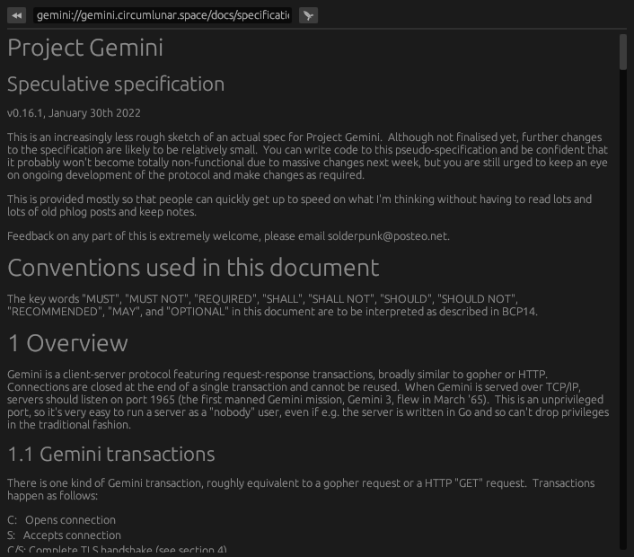

# gbrowse (gemini browser)

[`gemini project site`](https://gemini.circumlunar.space/)

Personally I think the gemini project itself is kind of a gimmick, but some friends were talking about a browser and I decided to make this.

It's not a masterpiece but I think it works quite well for the amount of time I put into it (~3hrs) and the number of SLOC (~200).

